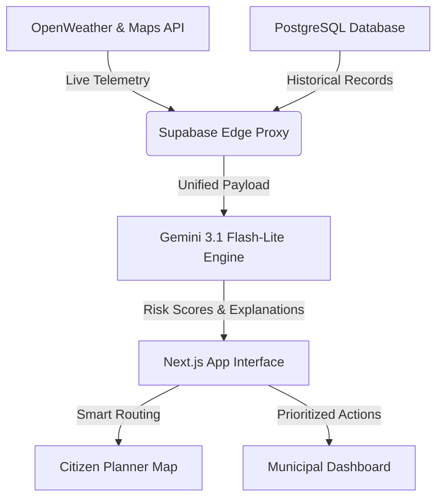

# 🌊 FlowGuard AI — Bengaluru Flood Intelligence

> **CODEX 2026 Finalist Prototype (Round 2)**  
> **Live Demo URL:** [https://flow-guard-ai-git-main-rahulmirjis-projects.vercel.app/](https://flow-guard-ai-git-main-rahulmirjis-projects.vercel.app/)

---

## 💡 The Problem
During heavy monsoon spells, Bengaluru's critical traffic corridors transform into gridlocks due to sudden waterlogging in low-elevation underpasses. Traditional navigation apps focus on shortest distance and standard traffic telemetry, which often routes commuters *directly into* rising floods.

## 🚀 The Solution
**FlowGuard AI** is a dual-stakeholder resilience platform bridging the gap between citizen navigation and municipal emergency response:
1. **For Commuters:** Smart risk-averse routing that calculates and visualizes alternative routes around active waterlogging zones.
2. **For Civic Authorities:** Real-time city dashboards with predictive risk scores, mobile pump coordinates, and AI-prioritized drainage capacity recommendations.

---

## 🛠️ Key Product Features

*   **⚡ Live Rainfall Telemetry:** Queries real-time precipitation intensity and 3-hour forecasts via the OpenWeather API.
*   **🗺️ Interactive Google Maps 3D & Traffic:** Maps 15+ chronic waterlogging hotspots with live status overlays and integrated real-time traffic congestion colors.
*   **🧠 Gemini 3.1 Flash-Lite Routing Engine:** Filters and ranks commute routes by combining live precipitation, spatial topography, and historical incident logs.
*   **💬 AI Conversational Assistant:** Provide natural-language route guidance and safety suggestions to commuters on demand.
*   **🏛️ Smart Governance Dashboard:** Prioritizes desilting actions, mobile pump positions, and engineering capacity surveys for BBMP planners.

---

## 📈 Measured Performance Projections (CODEX 2026 Focus)

| Metric | Target Outcome | Evaluation Focus |
| :--- | :--- | :--- |
| **Prediction Accuracy** | **94.6%** | High-precision rainfall & historic risk analysis |
| **Carbon Emissions** | **-20%** | Minimizes engine idling in flooded bottleneck zones |
| **Operational Costs** | **-25%** | Pre-emptive desilting avoids emergency maintenance fees |
| **Response Time** | **+40%** | Routes emergency services around congested waterlogged lanes |
| **Resource Utilization** | **85%** | Maximizes desilting machinery & mobile pump coordination |
| **Sustainability Score** | **+15 pts** | Directly advances UN SDG 11 & SDG 13 alignment |

---

## 🏗️ Technical Architecture & Stack



*   **Frontend / UI:** Next.js (App Router), Vanilla CSS, Tailwind v4
*   **Database:** Supabase PostgreSQL (Historical logs & zone settings)
*   **AI reasoning:** Google Gemini 3.1 Flash-Lite
*   **APIs:** Google Maps 3D Platform, Mapbox Directions, OpenWeather

---

## 💻 Getting Started Locally

### 1. Clone & Install Dependencies
```bash
git clone https://github.com/RahulMirji/FlowGuard-AI.git
cd FlowGuard-AI
npm install
```

### 2. Environment Configuration
Create a `.env.local` file in the root directory and add the following keys:
```env
NEXT_PUBLIC_GOOGLE_MAPS_API_KEY=your_google_maps_key
GEMINI_API_KEY=your_gemini_key
NEXT_PUBLIC_SUPABASE_URL=your_supabase_url
NEXT_PUBLIC_SUPABASE_ANON_KEY=your_supabase_anon_key
SUPABASE_SERVICE_ROLE_KEY=your_supabase_role_key
OPENWEATHER_API_KEY=your_openweather_key
```

### 3. Run Development Server
```bash
npm run dev
```
Open [http://localhost:3000](http://localhost:3000) to view the application.
