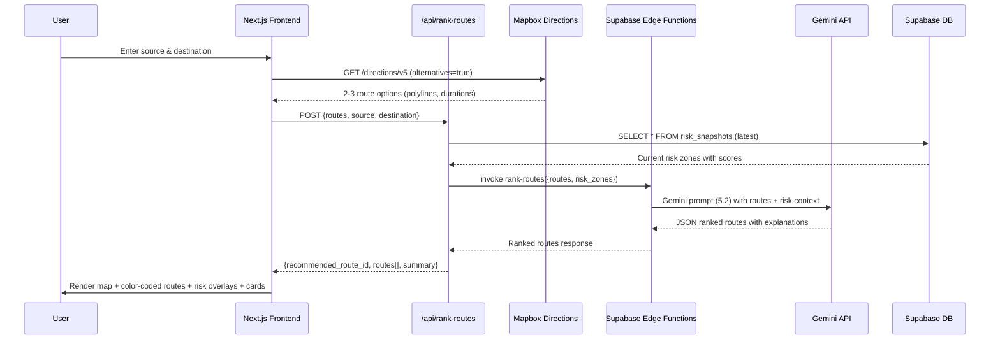
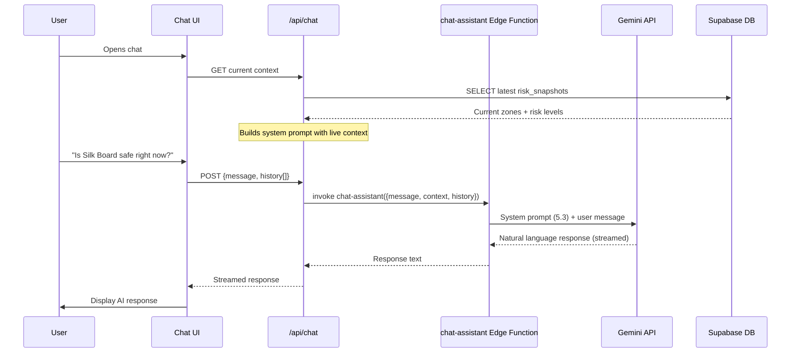
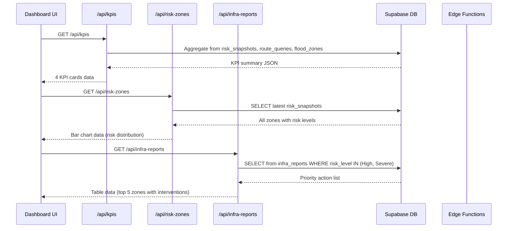

# Application Flow — FlowGuard AI

## 1. User Journey Overview

```
Landing Page → Route Risk Planner → AI Chat Assistant
     ↓                                      ↓
City Impact Dashboard ←────────────────────┘
```

**Primary flow:** User lands → checks route safety → gets AI advice → views city-wide impact.

---

## 2. Screen 1 — Landing Page

**Flow:**
1. Page loads → fetches KPI summary from `/api/kpis`
2. Renders hero, 3 KPI teaser cards, CTAs
3. User clicks "Check My Route" → navigates to `/planner`
4. User clicks "View City Dashboard" → navigates to `/dashboard`

**Data:** Single API call on mount → `calc-kpis` Edge Function → returns 4 KPI values.

---

## 3. Screen 2 — Route Risk Planner (Core)

### User Flow
1. User enters source + destination (text input or geolocation)
2. System fetches route alternatives from Mapbox
3. System fetches current flood-risk zones
4. System determines which routes pass near high-risk zones
5. System calls Gemini to rank routes with explanations
6. UI renders map + route cards + AI recommendation

### Sequence Diagram



### Geo-Proximity Check
- For each route polyline, check if any point is within ~500m of a risk zone's coordinates
- Uses haversine distance: `d = 2R × arcsin(√(sin²(Δlat/2) + cos(lat1)cos(lat2)sin²(Δlng/2)))`
- Zones within threshold are flagged as "crossed" for that route

---

## 4. Screen 3 — AI Chat Assistant

### User Flow
1. User opens chat → system loads current context (weather + risk zones)
2. User types a question about travel safety
3. System sends message + context to Gemini
4. AI responds with actionable, concise advice
5. Conversation continues with maintained context

### Sequence Diagram



---

## 5. Screen 4 — City Impact Dashboard

### Data Flow



### Dashboard Components
- **KPI Cards:** 4 metrics (accuracy, commute reduction, zones flagged, response time)
- **Bar Chart:** Risk level distribution (Low/Medium/High/Severe counts)
- **Line Chart:** Rainfall vs. commute delay (last 24h)
- **Table:** Priority Infrastructure Action List (sortable by priority)

---

## 6. Edge Function Caching Strategy

| Function | Cache Location | Refresh Trigger | TTL |
|----------|---------------|-----------------|-----|
| `get-flood-risk-zones` | `risk_snapshots` table | Scheduled (every 15 min) | 15 min |
| `rank-routes` | None (per-request) | Each user query | N/A |
| `chat-assistant` | None | Each message | N/A |
| `generate-infra-report` | `infra_reports` table | When risk_level changes | Until next change |
| `calc-kpis` | None (computed on-demand) | Each request | N/A |

### Refresh Flow (Background)
```
Every 15 min:
  1. Call OpenWeatherMap → get current + forecast rainfall
  2. Read flood_zones from DB
  3. Call Gemini (prompt 5.1) → get risk scores
  4. UPSERT into risk_snapshots
  5. For any zone where risk_level changed to High/Severe:
     → Call generate-infra-report → UPSERT into infra_reports
```
